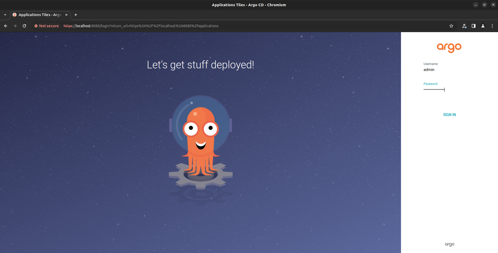
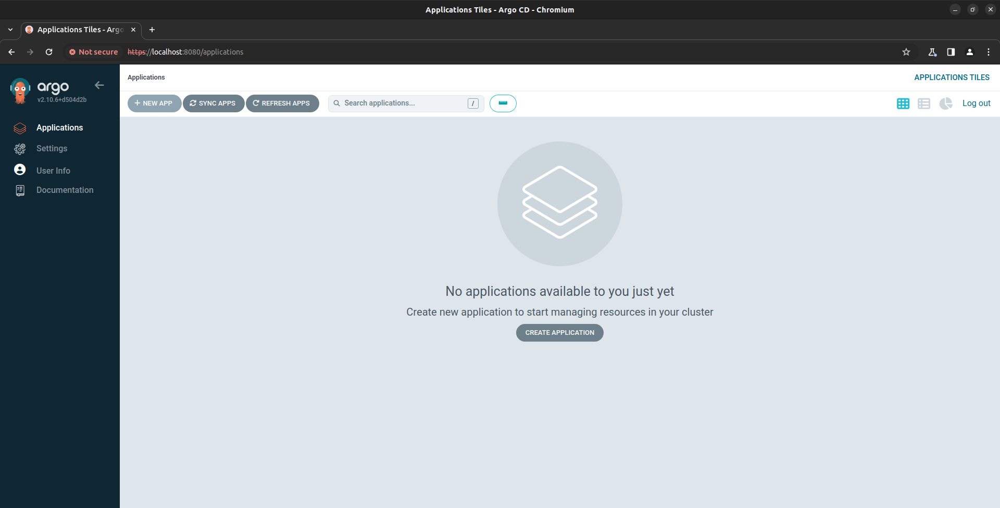

# Proof of Concept
## ArgoCD
### ArgoCD instalation
At first you need to crecate a cluster. We can use k3d for this.
```sh
k3d cluster create argocd
```

Next you need to create a namespace for ArgoCD with the next command:
```sh
kubectl create namespace argocd
```
Install ArgoCD.
```sh
kubectl apply -n argocd -f https://raw.githubusercontent.com/argoproj/argo-cd/stable/manifests/install.yaml
```
Now check if the installation was completed correctly:
```sh
kubectl get all -n argocd
```

### Access The Argo CD API Server
There is no LoadBalancer integrated in k3d. So in this case, you can do the port forwarding to access the API server with the command below:
```sh
kubectl port-forward svc/argocd-server -n argocd 8080:443
```
### Login in ArgoCD accout
To do that you need to go to "argocd-initial-admin-secret" and get your password (you should change recieved password because it is placed in open file)
```sh
argocd admin initial-password -n argocd
```
```sh
kubectl port-forward svc/argocd-server -n argocd 8080:443&
```
### Get secret to the admin user
```sh
kubectl -n argocd get secret argocd-initial-admin-secret -o jsonpath="{.data.password}" | base64 -d; echo
```
## Demo

### Open GUI ArgoCD
You need to open localhost:8080 in your browser to open ArgoCD GUI.
In GUI you need to use received password and "admin" as a username.



### You're inside ArgoCD interface!

